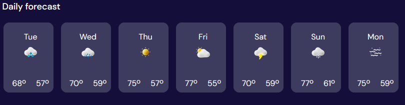
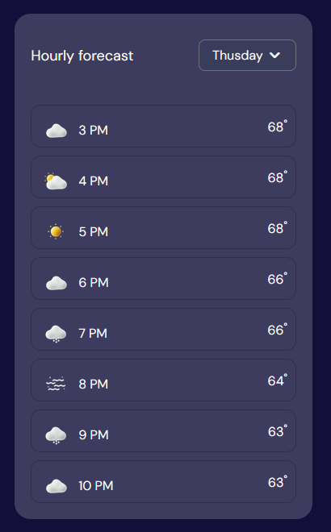
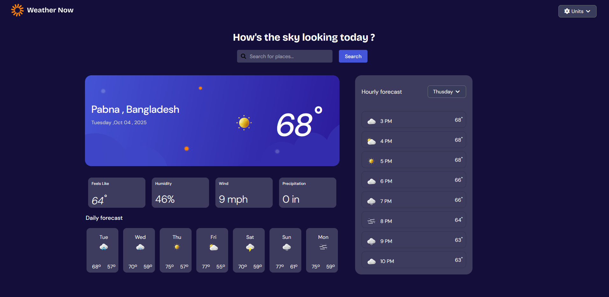

# Weather Web App

The  **Weather Forecast Web App UI** built with **HTML, CSS, and Font Awesome**.
The project is designed to showcase **current weather, hourly forecast, and a 7-day forecast** with a clean and modern interface.

---

## Features

✅ **Search bar** – Find weather by location <br>
✅ **Current weather section** – Location, date, temperature, and weather condition <br>
✅ **Weather reports** – Feels Like, Humidity, Wind, Precipitation <br>
✅ **7-day forecast** – Daily weather with icons and min/max temperature <br>
✅ **Hourly forecast** – Interactive card layout showing hourly  <br>
✅ **Responsive design** – Works across desktop and mobile <br>

---

## Tech Stack

* **HTML5**
* **CSS3**
* **Font Awesome (Icons)**
* **Google Fonts**

---

## Project Structure

```
📂 Weather-App
 ├── 📂 assets
 │    └── 📂 images
 │         ├── logo.svg
 │         ├── bg-today-large.svg
 │         ├── icon-sunny.webp
 │         ├── icon-rain.webp
 │         ├── icon-drizzle.webp
 │         ├── icon-partly-cloudy.webp
 │         ├── icon-storm.webp
 │         ├── icon-snow.webp
 │         └── icon-fog.webp
 ├── index.html
 └── style.css
```

---
## Live Link 

You Should <a href ="https://montasirabhi.github.io/weather/" > Click Me </a> For View This Site . 
## Installation

1. Clone the repository

```bash
git clone https://github.com/your-username/weather-app.git
```

2. Open `index.html` in your browser

---

## Screenshots

### 🌤 Current Weather Section


### 📅 Daily Forecast



### 🕒 Hourly Forecast



## Overall 



## Future Improvements

* [ ] Integrate real **weather API (OpenWeatherMap, WeatherAPI, etc.)**
* [ ] Add **unit switch (°C / °F)**
* [ ] Add **dark/light mode toggle**
* [ ] Make search functionality dynamic
* [ ] Responsive


---

## Author

👨‍💻 **MD MONTASIR RAHMAN ABHI**
Web Developer | Designer | Digital Marketer

---

## License

This project is **open-source** and available under the MIT License.

